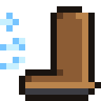

# Better Sprint

**Автор: Bogdan_Tokarev**

Мод меняет бег в Minecraft: вместо постоянной скорости спринт теперь **разгоняется**.



## Механика

| Параметр | Значение |
|---|---|
| Базовый спринт | 5.612 м/с (0.2806 блока/тик) |
| Прирост | +10% от базовой скорости за каждую секунду бега |
| Максимум | 8.612 м/с (0.4306 блока/тик), это +53.5% — «натуральный» потолок без зелий |
| Сброс после остановки | ~30% в секунду (плавно) |
| Сброс после удара по мобу с земли | ~75% в секунду (плавно) |

Поведение:

- **Разгон.** Пока игрок бежит и жмёт клавиши движения, буст растёт на 10%/сек и упирается в 8.612 м/с.
- **Прыжки не сбрасывают разгон** — скорость сохраняется и в воздухе, и при приземлении.
- **Резкая остановка** — буст тает плавно, а не мгновенно.
- **Инерция.** Если на момент остановки буст был больше 20%, игрок ещё немного **проскальзывает** вперёд по последнему направлению движения.
- **Удар по мобу в прыжке** (во время бега) — скорость **не сбрасывается**.
- **Удар по мобу с земли** — скорость плавно гасится (быстрее обычного спада).
- **Резкий поворот камеры** при бусте > 20% — игрока слегка **сносит в сторону поворота**, а камера **наклоняется** (до 5.5°) в ту же сторону. При ходьбе эффекта нет.
- В воде, в полёте/элитрах и верхом мод выключается.

> На 1.7.10 наклон камеры отключён — в той версии Forge нет события настройки камеры; разгон, инерция и снос в сторону работают.

Мод клиентский (`environment: client` / `clientSideOnly`), работает в одиночной игре и на серверах без античита на скорость.

## Скачать

Готовые JAR-ы всех версий: **[Releases → v1.0.0-build12](https://github.com/darkfantom012-web/cursor-mod-minecraft/releases/tag/v1.0.0-build12)**
(каждый пуш пересобирает все 11 портов и публикует новый релиз).

## Поддерживаемые версии

| Папка | Версия | Загрузчик |
|---|---|---|
| `versions/1.7.10-forge` | 1.7.10 | Forge (RetroFuturaGradle) |
| `versions/1.12.2-forge` | 1.12.2 | Forge |
| `versions/1.20.1-forge` | 1.20.1 | Forge |
| `versions/1.20.1-fabric` | 1.20.1 | Fabric |
| `versions/1.21.1-forge` | 1.21.1 | Forge |
| `versions/1.21.1-fabric` | 1.21.1 | Fabric |
| `versions/1.21.1-neoforge` | 1.21.1 | NeoForge |
| `versions/1.21.11-fabric` | 1.21.11 | Fabric |
| `versions/1.21.11-neoforge` | 1.21.11 | NeoForge |
| `versions/26.3-fabric` | 26.3 | Fabric |
| `versions/26.3-neoforge` | 26.3 | NeoForge |

Fabric-порты собираются на официальных маппингах Mojang, Forge/NeoForge — на своих штатных.
Для Fabric нужен **Fabric API**.

## Сборка

Каждая папка в `versions/` — самостоятельный Gradle-проект:

```bash
cd versions/1.21.1-fabric
gradle build          # готовый JAR появится в build/libs/
```

Требуемые JDK: 8 (1.7.10 / 1.12.2), 17 (1.20.1), 21 (1.21+).

### CI

Workflow `.github/workflows/build.yml` собирает **все** порты на GitHub Actions
и выкладывает JAR-ы артефактами (`BetterSprint-<версия>-<загрузчик>` и общий `BetterSprint-ALL`).

## Структура

- `common/.../SprintEngine.java` — вся физика разгона, чистая Java без классов Minecraft; копируется в каждый порт.
- `tools/gen_projects.py` — генератор всех портов из общих шаблонов.
- `tools/make_icon.py` — генератор иконки 16×16 в стиле Minecraft.
- `assets/icon.png` — иконка мода 16×16.
